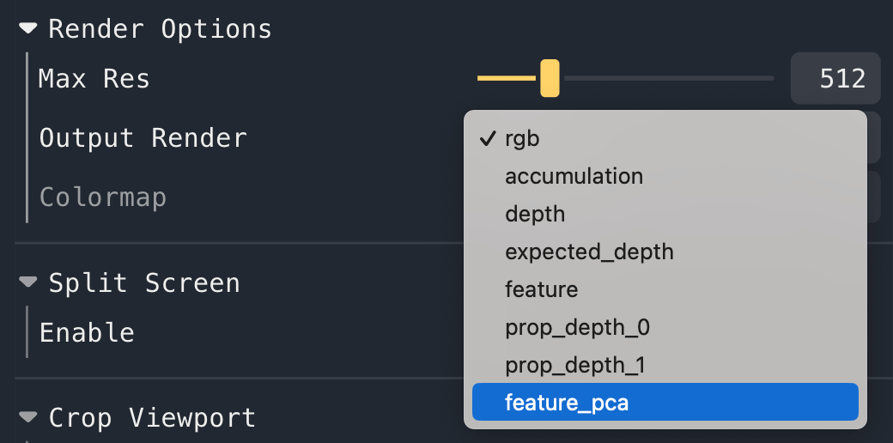
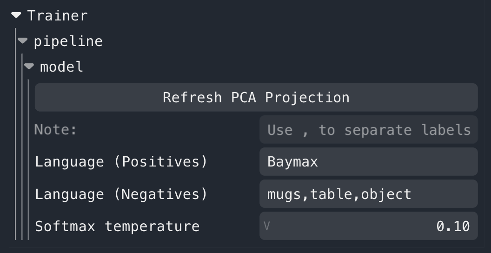
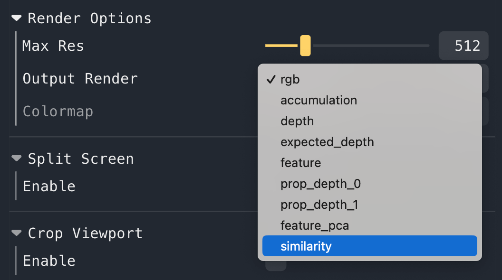
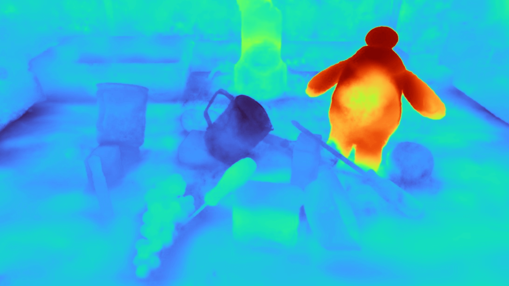

# Distilled Feature Fields Enable Few-Shot Language-Guided Manipulation

### [🌐 Project Website](https://f3rm.github.io) | [📝 Paper](https://arxiv.org/abs/2308.07931) | [🎥 Video](https://www.youtube.com/watch?v=PA9rWWVWsc4)

We distill features from 2D foundation models into 3D feature fields, and enable few-shot language-guided manipulation
that generalizes across object poses, shapes, appearances and categories.

**[William Shen](https://shen.nz)<sup>\*1</sup>, [Ge Yang](https://www.episodeyang.com/)<sup>\*2</sup>,
[Alan Yu](https://www.linkedin.com/in/alan-yu1/)<sup>1</sup>,
[Jansen Wong](https://www.linkedin.com/in/jansenwong/)<sup>1</sup>,
[Leslie Kaelbling](https://people.csail.mit.edu/lpk/)<sup>1</sup>,
[Phillip Isola](https://people.csail.mit.edu/phillipi/)<sup>1</sup>**<br>
<sup>1 </sup>[MIT CSAIL](https://www.csail.mit.edu/),
<sup>2 </sup>[Institute of AI and Fundamental Interactions (IAIFI)](https://iaifi.org/)<br>
<sup>* </sup>Indicates equal contribution<br>
CoRL 2023 (Oral)

-----

**Table of Contents**

- [Installation](#installation)
- [Usage](#usage)
    - [Downloading Example Datasets](#downloading-example-datasets)
    - [Training a Feature Field](#training-a-feature-field)
    - [Using our Custom Viewer](#using-our-custom-viewer)
    - [Using the Nerfstudio Viewer](#using-the-nerfstudio-viewer)
    - [Extracting CLIP and DINO Features](#extracting-clip-and-dino-features)
- [Troubleshooting](#troubleshooting)
- [Citation](#citation)

## Code

We currently release our implementation for training feature fields. We will release our custom viewer and the robot
manipulation code soon.

F3RM is built on top of [Nerfstudio](https://github.com/nerfstudio-project/nerfstudio) following their
[guide for adding new methods](https://docs.nerf.studio/en/latest/developer_guides/new_methods.html).

### Installation

**Note:** this repo requires an NVIDIA GPU with CUDA 11.7+ for NeRF and feature field distillation. We tested our
implementation on a RTX3090 with 24GB of VRAM.

```bash
# Clone the repo
git clone https://github.com/f3rm/f3rm.git
cd f3rm

# Create conda environment. Feel free to use a different package manager
conda create -n f3rm python=3.8
conda activate f3rm

# Install torch per instructions here: https://pytorch.org/get-started/locally/
# Choose the CUDA version that matches your GPU
pip install torch==2.0.1+cu118 torchvision==0.15.2+cu118 --extra-index-url https://download.pytorch.org/whl/cu118

# Install tiny-cuda-nn, this might take a few minutes
pip install ninja git+https://github.com/NVlabs/tiny-cuda-nn/#subdirectory=bindings/torch

# Install F3RM project and dependencies (including nerfstudio)
pip install -e .

# Install command line completions for nerfstudio
ns-install-cli

# Test your installation, and check 'f3rm' is a valid method
ns-train --help
```

See [Troubleshooting](#troubleshooting) if you have issues during installation. If you have a previous installation of
Nerfstudio, then you may need to deactivate all conda environments and then just activate the `f3rm` environment. This
is because prior versions of Nerfstudio may have installed the entry points to your `~/.local` directory, which could
cause conflicts with the new installation.

## Usage

### Downloading Example Datasets

We provide example datasets which you can download using the `f3rm-download-data` command. By default, the script will
download all the datasets (requires ~300MB disk space) into the `datasets/` directory relative to your current
directory.

Run `f3rm-download-data -h` to see how to download specific datasets or set your own save directory. We provide a short
description of each dataset in [assets/datasets.md](assets/datasets.md).

### Training a Feature Field

We provide the functionality to train a NeRF and distill features in parallel. The default features we distill are CLIP
features. You can distill DINO features instead by adding `--pipeline.datamanager.feature-type DINO`.

```bash
ns-train f3rm --data <data_folder>
```

You can try F3RM with the example datasets which you can download following the
instructions [here](#downloading-example-datasets). Alternatively, you can prepare your own datasets following the
instructions in the [Nerfstudio documentation](https://docs.nerf.studio/en/latest/quickstart/custom_dataset.html).

You do not need to run the training to completion. We save a checkpoint every 2000 steps by default. To see all the
options available for training, run `ns-train f3rm -h`.

**Resuming Training from a Checkpoint**

Use the `--load-dir` flag to resume training from a checkpoint. Nerfstudio writes the checkpoint files to the `outputs/`
directory relative to your current directory.

```bash
ns-train f3rm --data <data_folder> --load-dir {outputs/.../nerfstudio_models}
```

Checkout the [Nerfstudio documentation](https://docs.nerf.studio/en/latest/quickstart/first_nerf.html) for more details
on functionality.

### Using our Custom Viewer

Our custom web viewer is coming soon! Keep an eye on out for updates.

### Using the Nerfstudio Viewer

Once you have started training the feature field with `ns-train`, Nerfstudio will print a URL to the viewer in the
terminal (the URL will start with https://viewer.nerf.studio). You can open this URL to open the Nerfstudio viewer in
your browser to visualize training progress and the feature field. Alternatively, to visualize a trained model you can
run `ns-viewer --load-config {outputs/.../config.yml}`.

Note that if you are using a remote server, you will need to forward the port to your local machine
([instructions](https://docs.nerf.studio/en/latest/quickstart/viewer_quickstart.html#training-on-a-remote-machine)).
The default port used by Nerfstudio is 7007, but check the viewer URL to make sure. For a general guide on how to use
the Nerfstudio viewer, check out
their [documentation](https://docs.nerf.studio/en/latest/quickstart/viewer_quickstart.html).

**Visualizing the Feature Field PCA**

To visualize the PCA of the features, select `feature_pca` in the `Render Options -> Output Render` dropdown box.
Note that the initial PCA projection matrix is computed based on the features rendered at your current viewpoint.



To recompute the PCA projection based on your current viewpoint, click the "Refresh PCA Projection" button under
`Trainer/pipeline/model` near the bottom of the controls.

**Language Interaction with CLIP Feature Fields**

If you are distilling CLIP features (the default feature type), then you will see the following additional controls
under `Trainer/pipeline/model` near the bottom of the controls panel. You can enter positive and negative text queries
(separated by `,` commas), which will compute similarity heatmaps.



Then, to visualize these heatmaps, select `similarity` in the `Render Options -> Output Render` dropdown box.



We show the similarity heatmap over the `panda/scene_001` dataset for the "Baymax" query, with the negatives in the
controls above (you can download this dataset using the `f3rm-download-data panda` command). Try playing around with
different language queries and see what results you get!



**Note:** if multiple positive queries are specified, we average their CLIP embeddings before computing the pair-wise
softmax described in Section 3.3 of the [paper](https://arxiv.org/abs/2308.07931). The default temperature of 0.1 works
well.

### Extracting CLIP and DINO Features

We provide scripts to demonstrate how to extract CLIP and DINO features from their respective vision models. You can
use these features for your own NeRF pipeline or for other downstream applications.

- Run `python f3rm/scripts/demo_extract_features.py` for a general demo on how to extract CLIP and DINO features.
  This will create a plot showing the PCA of the CLIP and DINO features. The plot is saved
  to `demo_extract_features.png`.
- For details on how to extract CLIP features and compare the extracted features with CLIP text embeddings, run
  `python f3rm/scripts/demo_clip_features.py`. This script will create a plot showing the similarity heatmaps for a
  given
  text query, and will save a plot to `demo_clip_features-{text_query}.png`.

## Troubleshooting

### tiny-cuda-nn installation fails

If you get an error when installing tiny-cuda-nn that says something like "The detected CUDA version (12.2) mismatches
the version that was used to compile PyTorch (11.8). Please make sure to use the same CUDA versions", then this means
that your CUDA Toolkit version mismatches with the PyTorch installation.

The easiest way to fix this issue is to install the correct CUDA Toolkit version via conda:

1. Install CUDA toolkit via conda: `conda install -c "nvidia/label/cuda-11.8.0" cuda-toolkit`
2. Set `CUDA_HOME` to the conda CUDA toolkit path: `export CUDA_HOME=$CONDA_PREFIX`
    - Note: you only need to do this for the tiny-cuda-nn installation, no need to set this permanently.
3. Try installing tiny-cuda-nn again (this will take a few minutes):
   `pip install ninja git+https://github.com/NVlabs/tiny-cuda-nn/#subdirectory=bindings/torch`

You can install the CUDA toolkit via the instructions on the NVIDIA website if you prefer. Just make sure you install
the right version: https://developer.nvidia.com/cuda-toolkit-archive

### Language queries are not working in Nerfstudio viewer

The Nerfstudio viewer can sometimes fail to register the input you type into the text boxes if you are use the same
browser tab for different training runs. This means `feature_pca` and `similarity` may not appear in the Render Options.
To fix this issue, try closing the viewer tab and opening it again. If this doesn't work, please open an issue in this
repository.

### Running out of GPU memory

This codebase was tested on a RTX3090 with 24GB of GPU memory. If you are running out of memory when using the viewer,
try to decrease the rendering resolution. In the Nerfstudio viewer, you can change the `Max Res` under Render Options.

If you are running out of memory during any other stages, please open a GitHub issue and we will try to help.

## Acknowledgements

We thank the authors of the following projects for making their code open source:

- [Nerfstudio](https://github.com/nerfstudio-project/nerfstudio)
- [LERF](https://github.com/kerrj/lerf)
- [CLIP](https://github.com/openai/CLIP)
- [DINO](https://github.com/facebookresearch/dino)
  and [dino-vit-features](https://github.com/ShirAmir/dino-vit-features)

## Citation

If you find our work useful, please consider citing:

```
@article{shen2023F3RM,
    title={Distilled Feature Fields Enable Few-Shot Language-Guided Manipulation},
    author={Shen, William and Yang, Ge and Yu, Alan and Wong, Jansen and Kaelbling, Leslie Pack, and Isola, Phillip},
    journal={arXiv preprint:2308.07931},
    year={2023}
}
```
