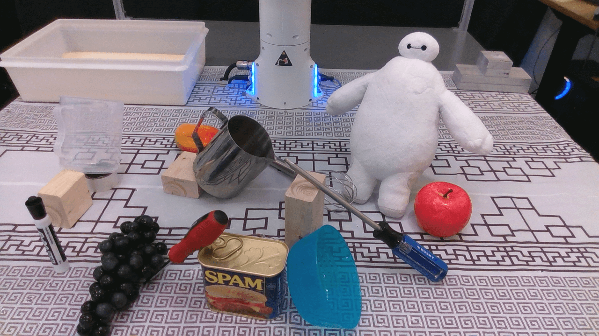
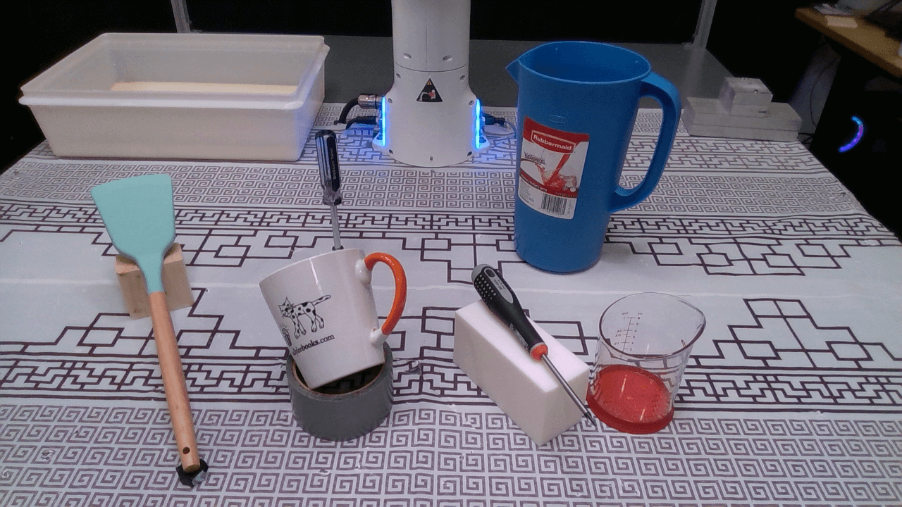

# Datasets

We provide a short descriptions of the example datasets we provide through the `f3rm-download-data` command.

___

**Table of Contents**

- [`panda`](#panda)
- [`rooms`](#rooms)

## `panda`

| Name      | Preview                                                             | Summary                                                                      | Objects Present                                                                                                                                                  | 
|-----------|---------------------------------------------------------------------|------------------------------------------------------------------------------|------------------------------------------------------------------------------------------------------------------------------------------------------------------|
| scene_001 |  | The teaser scene used throughout the paper, website and video.               | Transparent jug, mango, metal jug, Baymax plush toy, apple, blue screwdriver, red screwdriver, plastic bowl, can of SPAM, grapes, whiteboard marker, wood blocks |
| scene_002 |  | A scene we used for the language-guided manipulation results on the website. | Blue mug, measuring cup, pink mug, teddy bear, transparent jug, scissors, screwdriver, roll of tape, blocks                                                      |
| scene_003 |  | A test scene we used for language-guided manipulation.                       | Spatula, mug, water jug, blue screwdriver, black screwdriver, measuring beaker                                                                                   |