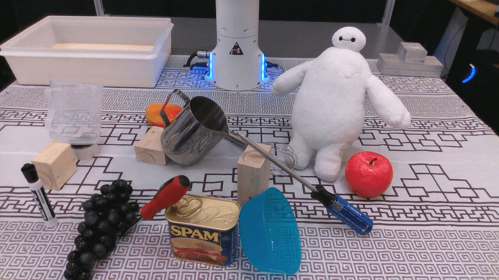
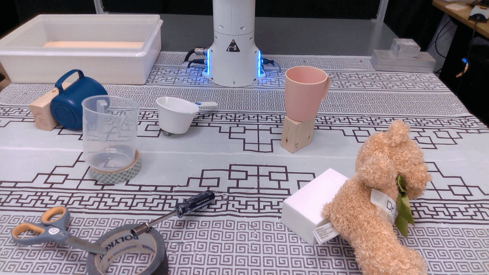
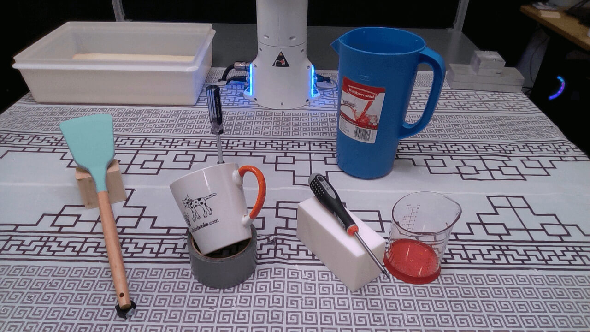
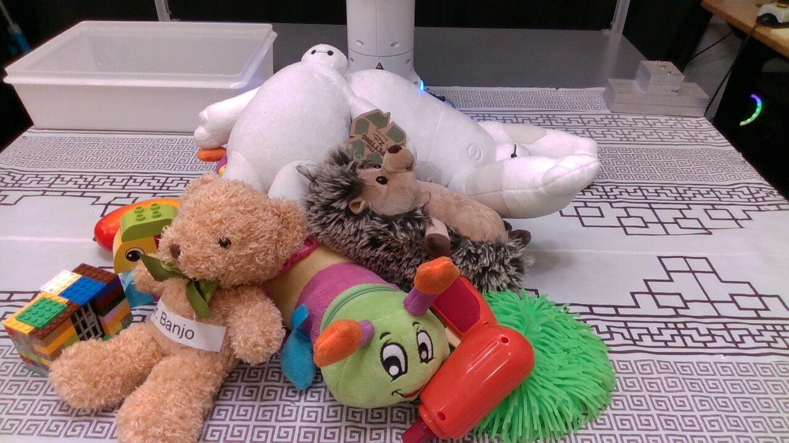
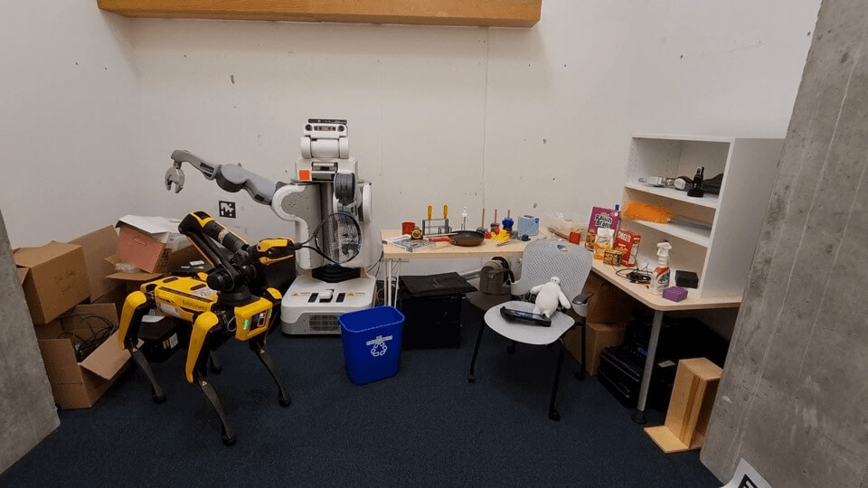
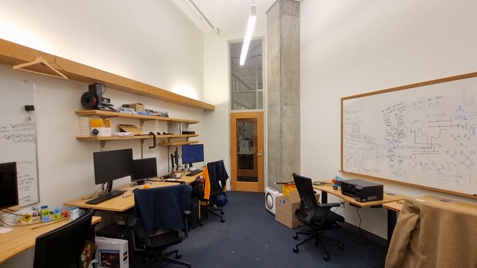

# Datasets

We provide a short descriptions of the example datasets we provide through the `f3rm-download-data` command.

___

**Table of Contents**

- [`panda`](#panda)
    - [`scene_001`](#scene_001)
    - [`scene_002`](#scene_002)
    - [`scene_003`](#scene_003)
    - [`scene_004`](#scene_004)
- [`rooms`](#rooms)
    - [`george_the_panda`](#george_the_panda)
    - [`pluto_the_spot`](#pluto_the_spot)

___

## `panda`

The `panda` datasets are taken by the robot using an Intel RealSense D415 mounted on a selfie stick. Each dataset
consists of 50 1280x720 RGB images of a scene with various objects collected around the lab in various poses. The RGB
sensor on the RealSense is not great, so the images do not have the highest quality.

### `scene_001`

The scene used throughout the paper, website and video for the language-guided manipulation results.

**Objects Present:** transparent jug, mango, metal jug, Baymax plush toy, apple, blue screwdriver, red screwdriver,
plastic bowl, can of SPAM, grapes, whiteboard marker, wood blocks

### `scene_002`

A scene we used for the language-guided manipulation results in the carousel on the website.

**Objects Present:** blue mug, measuring cup, pink mug, teddy bear, transparent jug, scissors, screwdriver, roll of
tape, blocks

### `scene_003`

Another test scene we used for language-guided manipulation.

**Objects Present:** spatula, mug, water jug, blue screwdriver, black screwdriver, measuring beaker, roll of tape,
wood block

### `scene_004`

This is a cluttered scene with many toys which was used in the figure for "Grasping in a Cluttered Scene" in the
paper. If you train a CLIP feature field for this scene, you should be able to observe clear separation in the
features between the different toys when querying via language. Some queries you could try out include "lego", "
hedgehog", "bowtie" and "colorful toys".

**Objects Present:** medium-size Baymax plush toy, large Baymax plush toy, hedgehog plush toy, caterpillar plush toy,
toy gun, green toy with strands, teddy bear with bowtie, lego house, lego figure, mango

___

## `rooms`

The `rooms` datasets consist of larger scenes in rooms which we captured using our phones. These datasets similarly
contain interesting objects which you can query via language using CLIP feature fields.

### `robot_room`

This scene is of our robot room with a Spot and PR2 robot. There are a variety of objects in the
scene which we encourage you to explore with CLIP feature fields. We list some of the objects below.

- **Robots:** Spot robot holding a tennis racket, PR2 robot
- **Small/medium objects:** book, screwdriver, hand sanitizer, mug, tape measure, pan, toys, tissue box, whisk, Raisin
  Bran, Cheez-It box, Goldfish bag, can of SPAM, cables, spray cleaner, robot arm, robot gripper, Baymax, tablet.
- **Large objects:** recycling bin, chair, table

### `back_office`

Scene of an office in Stata Center at MIT. Some objects on the shelf may not be well captured as the images don't always
get a good view of them.

- **Small objects:** books, toy plane, cables, Anki Cozmo (on shelf in box), frisbee, balls, computer mouse, headphones,
  electric drill
- **Medium objects:** inkjet printer, 3D printer (on shelf), roller blades (on ground), air purifier (on ground),
  monitors, keyboards, tennis rackets, jacket (on chairs)
- **Large objects:** chairs, tables, whiteboards, door, shelves, bags, boxes
