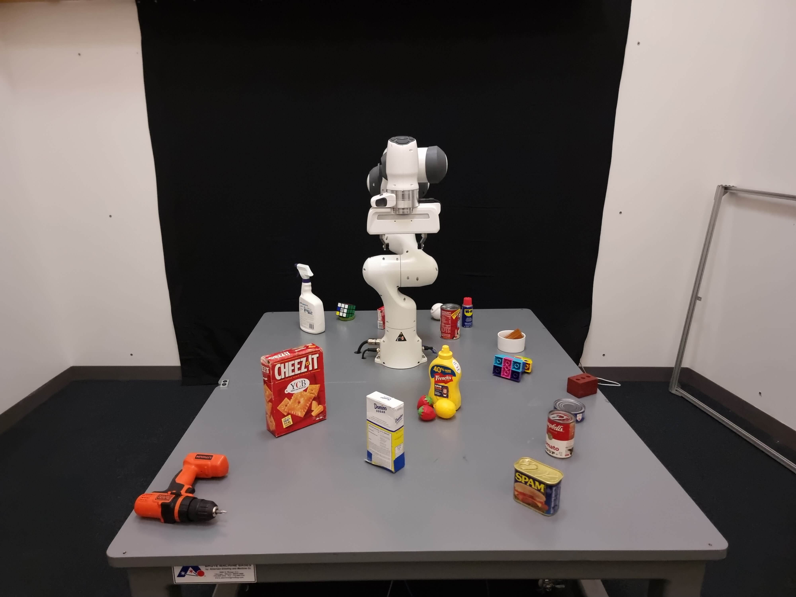
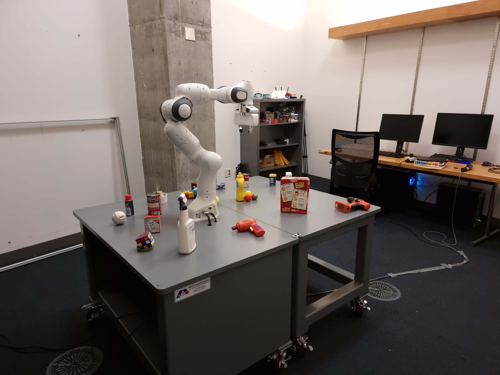

# Datasets

We provide a short descriptions of the example datasets we provide through the `f3rm-download-data` command.

___

**Table of Contents**

- [`panda`](#panda)
    - [`scene_001`](#scene_001)
    - [`scene_002`](#scene_002)
    - [`scene_003`](#scene_003)
    - [`scene_004`](#scene_004)
- [`rooms`](#rooms)
    - [`george_the_panda`](#george_the_panda)
    - [`pluto_the_spot`](#pluto_the_spot)

___

## `panda`

The `panda` datasets are taken by the robot using an Intel RealSense D415 mounted on a selfie stick. Each dataset
consists of 50 1280x720 RGB images of a scene with various objects collected around the lab in various poses. The RGB
sensor on the RealSense is not great, so the images do not have the highest quality.

### `scene_001`

The teaser scene used throughout the paper, website and video.

**Objects Present:** transparent jug, mango, metal jug, Baymax plush toy, apple, blue screwdriver, red screwdriver,
plastic bowl, can of SPAM, grapes, whiteboard marker, wood blocks

### `scene_002`

A scene we used for the language-guided manipulation results in the carousel on the website.

**Objects Present:** blue mug, measuring cup, pink mug, teddy bear, transparent jug, scissors, screwdriver, roll of
tape, blocks

### `scene_003`

Another test scene we used for language-guided manipulation.

**Objects Present:** spatula, mug, water jug, blue screwdriver, black screwdriver, measuring beaker, roll of tape,
wood block

### `scene_004`

This is a cluttered scene with many toys which was used in the figure for "Grasping in a Cluttered Scene" in the
paper. If you train a CLIP feature field for this scene, you should be able to observe clear separation in the
features between the different toys when querying via language. Some queries you could try out include "lego", "
hedgehog", "bowtie" and "colorful toys".

**Objects Present:** medium-size Baymax plush toy, large Baymax plush toy, hedgehog plush toy, caterpillar plush toy,
toy gun, green toy with strands, teddy bear with bowtie, lego house, lego figure, mango

___

## `rooms`

The `rooms` datasets consist of room-scale scenes which we captured using our phones. These datasets similarly contain
interesting objects which you can query via language using CLIP feature fields.

### `george_the_panda`

&nbsp;

This scene is of the room that George, our Panda robot, used to live in. The table and room contains a variety of
objects, many of which are from the YCB dataset. There are 70 images with an original resolution of 3000x4000
(Nerfstudio should automatically select the downscaled images for training). Some of the objects may not be fully picked
up by the CLIP feature field as the source images do not get a good view of the object.

**Objects Present:**

- **On the table:** electric screwdriver, Cheez-It box, Domino Sugar box, mustard bottle, strawberries, lemon, soup
  cans, can of SPAM, can of tuna, brick, Lego toy, white bowl, tennis ball, baseball, WD-40 can, Jello box, Rubik's
  cube, cleaning spray, toy gun
- **In the room:** cabinet, office chairs, monitors

### `pluto_the_spot`

&nbsp;

This scene is of the room that Pluto, our Spot robot, lives in. You may notice that this is the same room as the
`george_the_panda` dataset and you'd be right! There are `x` images in this scene. There are a variety of objects, both
small and large in this scene.

**Objects Present:**

- **Small/medium objects:** fill in
- **Large objects:** fill in
