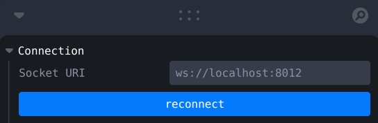
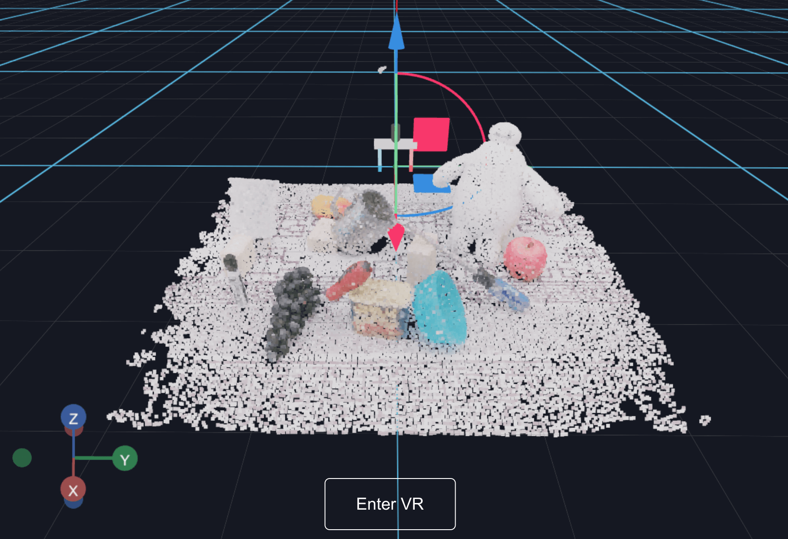
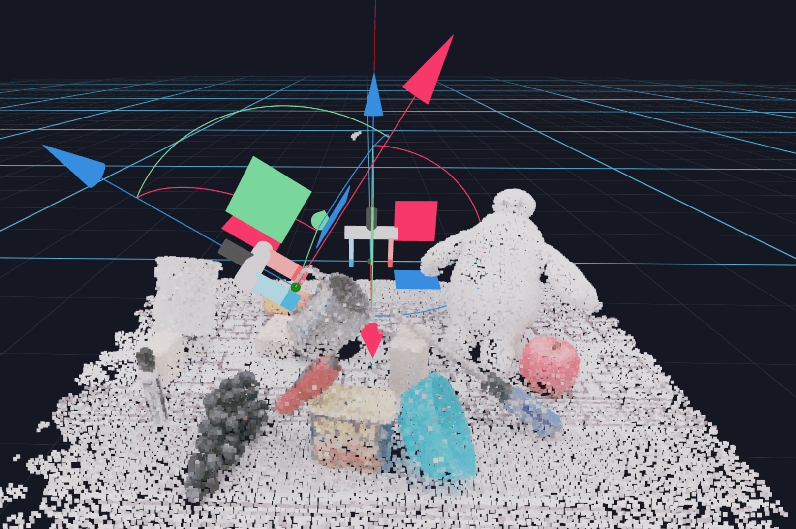

# Labeling Demos in VR

We support labeling demos in the browser and VR using the [Vuer](https://docs.vuer.ai/) library. Vuer is a light-weight
visualization toolkit for interacting with dynamic 3D and robotics data. It is VR and AR ready, and can be run on mobile
devices.

Vuer is still under development, so it may be buggy. If you encounter any problems, please open a GitHub issue.

---

**Table of Contents**

- [Installation](#installation)
- [Usage](#usage)
- [Troubleshooting](#troubleshooting)

## Installation

Follow the installation instructions in
[Step 4 of the main README](../README.md#4-optional-install-dependencies-for-robot-manipulation-code) to install the
dependencies required for this demo.

## Usage

We assume you are in the top-level directory of this repository. The coordinate system used by the script and viewer is
x-forward, y-left, z-up (you can change this).

### 1. Start the script

Run:

```bash
python f3rm_robot/examples/label_demos.py
```

### 2. Enter a path to a point cloud or Nerfstudio outputs

The script will ask you to enter a path to a point cloud or Nerfstudio outputs `config.yml` file. In this example, we
provide a path to a trained feature field (you can follow
the [instructions here](../f3rm_robot/README.md#1-train-a-feature-field) to get a feature field at the same path).
Alternatively, bring your own point cloud!

```text
=> Enter path to point cloud or nerfstudio outputs: f3rm_outputs/scene_001/f3rm/config.yml
```

### 3. Open Vuer in your browser

The script then samples a point cloud from the feature field or loads the point cloud from the path you provided. You
can then open the URL to Vuer printed in the terminal. By default, the URL
is [https://vuer.ai?ws=ws://localhost:8012](https://vuer.ai?ws=ws://localhost:8012).

```text
✅ Done loading checkpoint from f3rm_outputs/scene_001/f3rm/nerfstudio_models/step-000004999.ckpt
Sampling point cloud for visualization: 100457it [00:02, 48058.06it/s]                                                                                                   
Serving file:///home/william/workspace/vqn/f3rm-new at /static
Visit: https://vuer.ai?ws=ws://localhost:8012
```

If you are running the script on a remote machine, make sure to forward the port to your local machine so the websocket
can connect in the Vuer window in your browser. You can forward the port using
`ssh -L 8012:localhost:8012 <user>@<remote machine>` (change this if you are using a different port).

If you are using a VR headset, consider using a service like [ngrok](https://ngrok.com/) to forward the port to the
internet so you can access the Vuer window in VR. You will need to change the websocket address in the "Socket URI"
controls near the top-right to match the ngrok address (tip: you will probably need to use a secure websocket which is
prefixed with `wss://`).



### 4. Label the demos!

You can label demos in the browser on your own computer, or in VR if you have a VR headset. To enter VR, click the "
Enter
VR" button in the bottom-center of the Vuer window on a VR-enabled device.



We create "gripper" objects at the origin which you can move around using the gizmo. In VR, you can click and hold onto
the white cube to select the gripper, and move it around using your hand controller.


Whenever you move a gripper, the poses will be saved to a demo JSON file in the schema that we use.

```text
Saving gripper states to 2024-02-02_13-09-19_scene_demo.json
Time since last gripper event: 5.03s
```

Once the gripper is moved 10cm in L2 distance from the origin, a new gripper will be created at the origin, so you can
label multiple demos for a scene. If you do not move the gripper from the origin, its pose will not be saved.



Feel free to make changes to the script to suit your needs. The example provided is best used with our datasets and
setup.

### 5. Generate a Task using the feature field and demos (optional)

Follow this step if you want to generate your own task embeddings for pose optimization. Run
the [`generate_task.py`](../f3rm_robot/examples/generate_task.py) script with the path to the scene config and the demo
JSON file. See the [FAQ here](../f3rm_robot/README.md#how-can-i-generate-my-own-task-embeddings) for more information.

```bash
# Use the -h flag to see the available options
python f3rm_robot/examples/generate_task.py --scene f3rm_outputs/scene_001/f3rm/config.yml \
  --demo_fname 2024-02-02_13-09-19_scene_demo.json
```

## Troubleshooting

Vuer is still under development, so you may encounter the occasional bug. If you encounter any problems not listed
below, please open a GitHub issue.

### The browser window for Vuer isn't updating

Try clicking the "reconnect" button near the top-right of the Vuer window. Make sure the websocket address is correct.
By default, the websocket address is `ws://localhost:8012`.


If you are using a remote machine, make sure you have forwarded the relevant port to your local machine. You can forward
the port using `ssh -L 8012:localhost:8012 <user>@<remote machine>`.

### Vuer says "VR unsupported"

Make sure you are using a browser that supports WebXR. If you do not have a VR headset, you can still use Vuer on your
monitor and move the axes on the gripper around with your mouse to label your demonstrations. If you want to try out
what Vuer would look like in VR, you can use a WebXR emulator.

