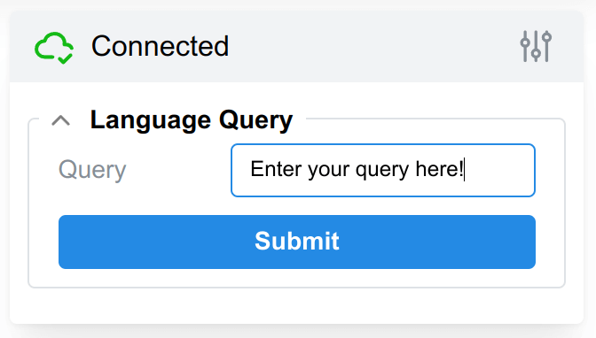
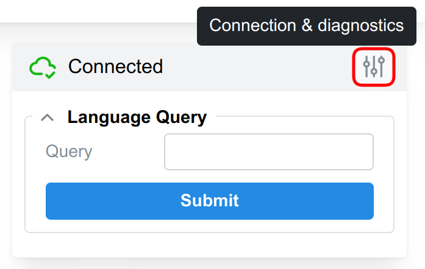
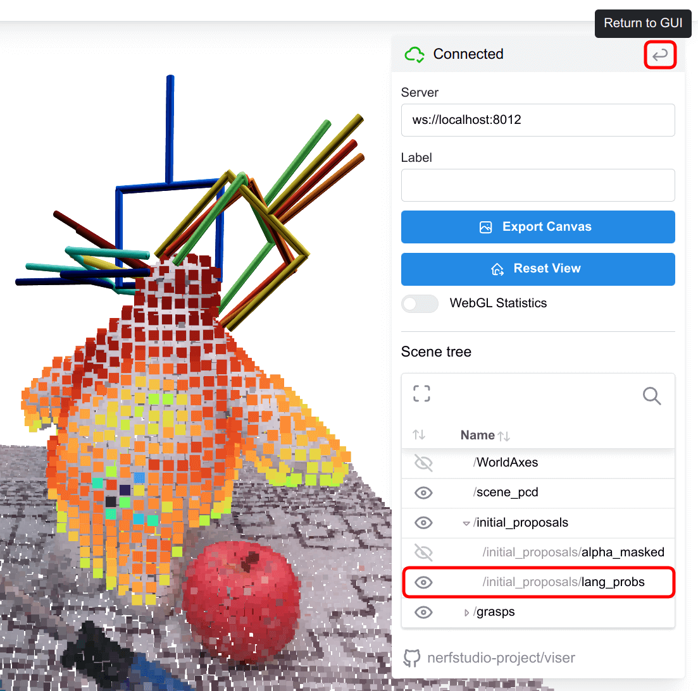

# Language-Guided Pose Optimization using F3RM

We provide a clean implementation of language-guided pose optimization using F3RM: Feature Fields for Robotic
Manipulation.

-----
**Table of Contents**

- [Installation](#installation)
- [Usage](#usage)
    - [Tutorial](#tutorial)
    - [Using the Visualizer](#using-the-visualizer)
- [FAQ](#faq)
- [Troubleshooting](#troubleshooting)
    - [The Visualizer is not working](#the-visualizer-is-not-working)
    - [Running out of GPU memory](#running-out-of-gpu-memory)
    - [ValueError: Could not find nerf_to_world.json in ...](#valueerror-could-not-find-nerf_to_worldjson-in-)

## Installation

Follow the installation instructions in
[Step 4 of the main README](../README.md#4-optional-install-dependencies-for-robot-manipulation-code) to install the
dependencies required for running the robot code. You can find information about the code
structure [here](/assets/code_structure.md#f3rm_robot).

## Usage

The typical workflow on the robot involves:

1. Collecting multiple images of the scene using a calibrated RGB camera.
2. Training a feature field using `ns-train f3rm` as described in the main [README](../README.md).
3. Use `f3rm-optimize --scene <path to output config>` to optimize grasp poses using language queries. The script will
   ask you to provide queries in the command line and supports web-based visualization of the optimization process.
4. Executing the optimized grasps on the robot.

We do not provide code for steps 1 and 4 - you will need to implement these yourself based on your robot setup.
The `f3rm-optimize` command provides the functionality to optimize grasp poses once you have a trained feature field.

We provide a tutorial on one of our example datasets below. For general information and answers to some common
questions, please see the [FAQ](#faq). For troubleshooting, see the [Troubleshooting](#troubleshooting) section. Note
that our collision checking assumes that you are using the default Franka Panda gripper. See
[What if I'm using a different gripper or robot?](#what-if-im-using-a-different-gripper-or-robot) for more information.

### Tutorial

We provide a tutorial on how to use language-guided pose optimization using the F3RM datasets.

**Note:** If you previously downloaded the datasets before the robot code was released, you will need to re-download
them using `f3rm-download-data panda`. We added the calibration between the NeRF and world coordinate frames in the
`nerf_to_world.json` file.

#### 1. Train a Feature Field

We will use `f3rm/panda/scene_001` for this tutorial. See a description of each dataset
provided [here](../assets/datasets.md). Make sure you're in the base directory of this repository.

```
ns-train f3rm --data datasets/f3rm/panda/scene_001 --max-num-iterations 5000 \
  --output-dir f3rm_outputs --timestamp ''
```

We set `--output-dir` to a separate output directory to Nerfstudio and `--timestamp` to empty string, so that the
outputs are saved to `f3rm_outputs/scene_001/f3rm`.

The training takes up to ~5 minutes on a RTX3090. You can train for fewer steps, but the quality of the geometry from
NeRF will be reduced. In our experiments in the paper, we used 2000 steps and downscaled the input images to 640x360
(they are 1280x720 in the dataset).

Stop the training script using `Ctrl + C` once training is finished. Note that Nerfstudio will print the path to the
"Config File" which you use as the scene for `f3rm-optimize` in the next step.

#### 2. Start the optimization script

```bash
f3rm-optimize --scene f3rm_outputs/scene_001/f3rm/config.yml
```

By default, visualization is enabled which you can view at http://localhost:8012. If you are running the script on a
remote machine, don't forget to forward the port.

Note that visualization slows down the optimization. You can disable visualization using the `--visualize False` flag.
To see all the options available for the `f3rm-optimize` command, run `f3rm-optimize --help`.

#### 3. Provide language queries and optimize

Once the script loads the feature field and CLIP, it will wait for you to provide language queries. If you are using the
visualizer (http://localhost:8012), you can enter the query in the visualizer textbox and click "Submit".


If you have disabled the visualizer, you can provide a queries in the command line `Enter query (empty to exit): `.
The script will ask for a query, optimize for poses, then ask for another query until you exit (empty query). You can
check what objects are in the scene by observing the point cloud in the visualizer. The queries we used in the
paper and website for this scene were: "Baymax", "blue screwdriver", "bowl", "red screwdriver", and "transparent jug".
The "metal jug" predicted an unstable grasp when we optimized. Feel free to try the other objects in the scene.

Once you enter the language query, we 1) retrieve the relevant demonstrations, 2) generate initial 6-DOF proposals,
and 3) optimize the grasp proposals. Use the visualizer to see the top proposals during the optimization process. Check
the [Using the Visualizer](#using-the-visualizer) section for more information and on what intermediate outputs are
shown.

The optimization script will write outputs including args, metrics and the optimized grasps to the directory where the
feature field is saved. You can check the printed outputs in the command line for the exact paths. Please note that the
optimization process is stochastic and may not always converge to the same results. By default, we uniformly sample 8
rotations for each voxel in the initial proposals and remove grasps which are in collision with the scene.

### Using the Visualizer

The visualizer will by default be served at http://localhost:8012. You can change the host and port using
the `--viser-host` and `--viser-port` flags, respectively.

Our visualizer is powered by [Viser](https://github.com/nerfstudio-project/viser) (thanks to the Nerfstudio team for
building this!).

#### View Controls

- Left Click and drag to rotate.
- Right Click and drag to pan.
- Scroll to zoom in and out.
- WASD to move forward, left, back, and right.
- Q and E to move up and down.

#### Entering Language Queries

The GUI for entering language queries should appear in the top-right of the visualizer. This may take a few seconds to
load as we only initialize it once the feature field and CLIP has been loaded. You should
see `Enter query in the visualizer at: ...` in stdout when the GUI is ready.



You can enter your query in the textbox and click the submit button to start the optimization process. The textbox and
button will be disabled during optimization, and reset once the optimization is finished.

#### Visualizing the Optimization Process

After each optimization step, we find the grasps with the lowest losses and visualize them as skeleton grippers. By
default, we show the top 10 grasp poses during optimization. You can change this using the `--num-poses-to-visualize`
flag. The color of the gripper corresponds to the loss value, with red being the lowest loss (best) and blue being
the highest lost within the top grasps. See the GIF [above](#3-provide-language-queries-and-optimize) for an example of
the optimization process.

Note: we do not run collision checking on the grasp poses during optimization, but do so after the final optimization
step.

#### Visualizing the Initial Proposals

If you haven't already, submit a language query. Then, click on the "Connection and Diagnostics" button on the
top-right (highlighted in red below) so we can view the scene tree.



You should see the "Scene tree" in the 2nd half of the window. You can expand the `/initial_proposals` node and toggle
the initial proposal point clouds using the 'eye' icon. Similarly, you can show/hide other nodes in the scene
tree such as the scene point cloud, and the grasps.

<p>

<br>
<em>Here, we toggled the /initial_proposals/lang_probs node to show the language mask for "Baymax"</em>
</p>

Once you are done, you can switch back to the GUI using the "Return to GUI" button on the top-right (highlighted in red
above), and continue entering language queries.

## FAQ

- [How can I execute the grasps on my robot?](#how-can-i-execute-the-grasps-on-my-robot)
- [What if I'm using a different gripper or robot?](#what-if-im-using-a-different-gripper-or-robot)
- [Why does the collision checking not remove all collisions?](#why-does-the-collision-checking-not-remove-all-collisions)
- [The grasps visually look good, can I count that as a success?](#the-grasps-visually-look-good-can-i-count-that-as-a-success)
- [The rotations in the grasps seem very incorrect, what's going on?](#the-rotations-in-the-grasps-seem-very-incorrect-whats-going-on)
- [Why doesn't the optimization target the right object specified by my language query?](#why-doesnt-the-optimization-target-the-right-object-specified-by-my-language-query)
- [Where are the task embeddings?](#where-are-the-task-embeddings)
- [How can I generate my own task embeddings?](#how-can-i-generate-my-own-task-embeddings)

### How can I execute the grasps on my robot?

The optimization script writes a ranked list of 6-DOF poses (from best to worst) to a `grasps_to_world.pt` file for each
language query. You can load these grasps, iterate through them and run inverse kinematics and motion planning to find a
valid motion plan to the grasp pose.

In our real robot setup, we compute intermediate pre-grasp and post-grasp poses to make motion planning a bit easier.
We also recommend you run further collision checking (see
[Why does the collision checking not remove all collisions?](#why-does-the-collision-checking-not-remove-all-collisions)).

### What if I'm using a different gripper or robot?

Our optimization code uses the default Franka Panda gripper for collision checking. The Panda's gripper is known for
being relatively large and bulky, which tends to lead to more collisions. This means you could get away with using our
default collision checking, but it may remove more grasps than necessary.

If you are using a different gripper, you will need to modify the collision checking code in
[`f3rm_robot/collision.py`](/f3rm_robot/collision.py). You will need to provide a mesh file for your gripper, and tune
the collision checking arguments for voxelizing the mesh, the overlap threshold, etc.

### Why does the collision checking not remove all collisions?

Our collision checking is relatively primitive and coarse. We first voxelize a mesh of the Panda gripper, then transform
each of these points by the gripper pose, and query the NeRF to get the density. We consider the gripper pose in
collision if the number of points with density is above a certain threshold.

You can check out the implementation for yourself in [`f3rm_robot/collision.py`](/f3rm_robot/collision.py). We run
further collision checking in our motion planner as not all collisions are detected by this method. We recommend that
you do so as well if you are working with complex scenes.

### The grasps visually look good, can I count that as a success?

No. While the grasps may look reasonable in the visualizer, they may not be stable in the real-world due to slight
errors in the predictions. Some grasps that may not look good in the visualizer might actually work in the real-world.
You should execute the grasps on your real robot to determine whether they are successful.

### The rotations in the grasps seem very incorrect, what's going on?

Our inference procedure involves:

1. Coarse pre-filtering for the translational degrees-of-freedom using alpha masking (we use marching cubes) and
   language masking using CLIP features. We call these 'voxels' in the code.
2. Sampling `--num-rots-per-voxel` rotations (default = 8) for each voxel to get the 6-DOF proposals. Note we sample
   uniformly over SO(3).
3. Optimizing the 6-DOF proposals using language-guided grasp pose optimization. This may be considered as fine-tuning
   the initial 6-DOF proposals.

Since we sample rotations uniformly over SO(3), we may not sample a good rotation for the object we want to grasp. The
optimization limits the extent to which we can adjust the rotations. Increasing the `--num-rots-per-voxel` flag can help
improve the results at the cost of increased optimization time. Since the optimization and sampling is stochastic,
retrying your language query may lead to better results in some cases.

F3RM could also just fail to find a good grasp. This could be due to the small number of demonstrations, loss
function not being conducive to the task, features not being useful, poor geometric reconstruction from the NeRF, etc.

### Why doesn't the optimization target the right object specified by my language query?

Your language query should describe the object you want to grasp. The more specific you are with your language query,
the higher chance the optimization process will find a grasp that correctly targets your object. While the system is
open-ended and queries such as "pick up the red mug" could work, you will find a higher chance of success if you just
query "red mug" by limiting extraneous information.

CLIP features can also behave like a bag-of-words and struggle to capture relationships, attributes, and ordinal
information within sentences. For example, in queries such as "black screwdriver" and "mug on a can of spam," we found
that CLIP paid more attention to other black objects and the can of spam, respectively.

Grasps may have also been filtered out due to collisions with the scene, and our language masking could have
masked out too much (you can try playing around the negatives in the [`f3rm_robot/optimize.py`](/f3rm_robot/optimize.py)
script). We recommend you to [visualize the initial proposals](#visualizing-the-initial-proposals) for a deeper
understanding of what's going on.

### Where are the task embeddings?

Our task embeddings for the mug lip, mug handle, screwdriver handle, caterpillar ear, and place cup on rack tasks are
provided in the [`f3rm_robot/assets/tasks`](/f3rm_robot/assets/tasks) directory. These are for CLIP ViT features, and
correspond to 10 demonstrations in total. You can use the `get_tasks` method in
[`f3rm_robot/task.py`](/f3rm_robot/task.py) to load and inspect them. We use these embeddings in the language-guided
pose optimization scripts.

### How can I generate my own task embeddings?

We provide the demonstration datasets and poses which you can download with `f3rm-download-data panda_demos`. Each of
these datasets contains a `scene_demo*.json` file which contains the demo poses in the world coordinate frame. Please
see the [datasets](/assets/datasets.md#panda_demos) page for more information.

Follow the short tutorial below for an example on how to generate task embeddings:

```bash
# 1. Train a feature field for a demo dataset (Ctrl+C once training is finished)
ns-train f3rm --data datasets/f3rm/panda_demos/caterpillar --max-num-iterations 5000 \
  --output-dir f3rm_outputs --timestamp ''

# 2. Run the example script. Use the -h or --help flag to see all the options.
# By default, this will bring up a visualizer which you can view at http://localhost:8012
# The task embedding is not saved unless you use the --save flag.
python f3rm_robot/examples/generate_task.py --scene f3rm_outputs/caterpillar/f3rm/config.yml \
  --demo_fname scene_demo.json
```

You can adapt the demonstration schemas and example script for your own datasets. As noted in the paper appendix, the
downstream performance can vary significantly across different samples of the query points. We recommend you sample
multiple sets of query points and select the best performing set over a set of test scenes for your given task.

## Troubleshooting

### The Visualizer is not working

By default, the Viser visualizer will run on http://localhost:8012. If you are using a remote machine, make sure you
have forwarded the relevant port to your local machine. You can forward the port
using `ssh -L 8012:localhost:8012 <user>@<remote machine>`.

You can adjust the host and port using the `--viser-host` and `--viser-port` flags.

### Running out of GPU memory

The default parameters for the optimization script were tested on a RTX3090 with 24GB of GPU memory. If you are running
out of memory, you will probably need to decrease the ray samples per batch for the optimization and collision checking
when using `f3rm-optimize`.

- `--ray-samples-per-batch` changes the batch size for optimization. The default is `2**18 = 262144`.
- `--CollisionArgs.ray-samples-per-batch` changes the batch size for collision checking. The default
  is `2**22 = 4194304`.

### ValueError: Could not find nerf_to_world.json in ...

You likely previously downloaded the datasets before the robot code was released. Try re-downloading the datasets using
`f3rm-download-data panda`. We added the calibration between the NeRF and world coordinate frames in the
`nerf_to_world.json` file.

For `f3rm/panda/scene_001` you will need to retrain your NeRF and feature field as the `transforms.json` was updated.
